# PDF Accessibility App

CUNY AI Lab's PDF remediation app turns uploaded PDFs into accessible output PDFs. The app is execution-first: it performs remediation automatically, exposes optional advanced review only for human-legible output, and sends non-trustworthy runs to manual remediation.

The release gate is strict:

- PDF/UA-1 compliance via `veraPDF`
- fidelity checks for text, reading order, tables, forms, links, and figures
- manual remediation when unresolved blocking conditions remain

The current design is Gemini-first for hard semantic decisions, but deterministic for PDF mutation.

## What The App Does

The runtime pipeline is:

1. `classify` - decide whether the PDF is digital, mixed, or scanned
2. `ocr` - add searchable text when needed
3. `structure` - extract document structure and build a canonical document model
4. `semantic adjudication` - ground Gemini against page images, native extraction, OCR candidates, and local context
5. `tag` - write the accessible PDF deterministically with `pikepdf`
6. `validate` - run `veraPDF` against PDF/UA-1
7. `fidelity` - decide whether the output is faithful enough for release
8. `publish result` - persist optional visible QA details for advanced inspection, limited to figure decisions and a few visible checks, while keeping structural blockers internal

## Architecture

```mermaid
flowchart LR
    A["Upload PDF"] --> B["Classify"]
    B --> C{"Scanned or mixed?"}
    C -->|Yes| D["OCR + page renders"]
    C -->|No| E["Native PDF extraction"]
    D --> F["Structure extraction"]
    E --> F
    F --> G["Canonical document model"]
    G --> H["Semantic units"]
    E --> H
    D --> H
    H --> I["Gemini structured outputs via OpenRouter"]
    I --> J["Resolved document model"]
    J --> K["Pretag rationalization + deterministic PDF writer\n(tags, ActualText, tables, forms, TOC)"]
    K --> L["veraPDF + fidelity gate"]
    L --> M{"Release-ready?"}
    M -->|Yes| N["Release-ready PDF"]
    M -->|No| O["Manual remediation"]
    N --> P["Optional advanced review\n(figure decisions and visible checks only)"]
```



More detail: [docs/architecture.md](docs/architecture.md)

## Session Model And Retention

The app does not use logins or accounts.

- each browser gets an anonymous HTTP-only session cookie
- every uploaded PDF job is bound to that browser session on the backend
- the dashboard and all job, download, preview, and review APIs only return jobs owned by the current browser session
- uploaded PDFs, processing artifacts, and output files expire after `JOB_TTL_HOURS`, which defaults to `12`

Practical implications:

- a user can close the tab and come back later from the same browser profile
- a different browser or a cleared-cookie profile will not be able to see existing jobs
- the app is intentionally ephemeral; old jobs age out even if the user never deletes them manually

This isolation applies to the app's own API and stored job state. Semantic
adjudication still uses the configured LLM provider described below.

## Current Evidence

### Exact curated corpus

Artifact: [backend/data/benchmarks/corpus_20260308_202258/corpus_report.md](backend/data/benchmarks/corpus_20260308_202258/corpus_report.md)

- `25 / 25` successful outputs complete, compliant, and fidelity-passed
- `2` remaining failures are damaged input PDFs

### Representative non-huge corpus

Artifact: [backend/data/benchmarks/corpus_20260311_121723/corpus_report.md](backend/data/benchmarks/corpus_20260311_121723/corpus_report.md)

Corpus mix:
- faculty/admin guides
- articles and readings
- syllabi/course materials
- scans

Results:
- `7 / 7` complete
- `7 / 7` compliant
- `7 / 7` fidelity-passed
- `7 / 7` release-ready
- `0` manual remediation
- average OpenRouter cost per PDF: `$0.025602`
- median OpenRouter cost per PDF: `$0.013667`
- average runtime per PDF: `76.45s`

### Official form set (stress suite)

Artifact: [backend/data/benchmarks/corpus_20260309_123540/corpus_report.md](backend/data/benchmarks/corpus_20260309_123540/corpus_report.md)

- `7 / 7` complete
- `7 / 7` compliant
- `7 / 7` fidelity-passed

### Benchmarks and cost notes

See [docs/benchmarks.md](docs/benchmarks.md)

## Semantics Strategy

The app does not rely on one extractor.

- native PDF extraction anchors geometry and text where possible
- OCR provides local candidate text on hard regions
- Gemini decides meaning for hard units such as:
  - suspicious text blocks
  - complex tables
  - form labels
  - suspicious widgets and static form lookalikes
  - figures vs non-figures
  - charts, screenshots, and other dominant visual regions
  - TOC groups
  - complex reading-order pages
- deterministic code writes the final PDF objects

That split matters:
- Gemini decides semantics
- code decides PDF mutation
- `veraPDF` and fidelity decide release

## What Is Strong Today

- PDF/UA-1 tagging and metadata
- font remediation and Unicode repair
- link and annotation tagging
- TOC generation
- form labeling
- table risk detection and release gating
- widget rationalization before tagging
- figure reclassification when a "figure" is really a table or form region
- optional visible follow-up for figure changes, alt text, and annotation/link checks
- OpenRouter structured outputs with prompt caching, retries, and cost tracking

## What Is Still Partial

- complex table semantics beyond header-row and row-header modeling
- visual accessibility audits such as color contrast and color-only meaning
- rich media and advanced math semantics beyond conservative formula detection
- some PDF/UA rule families still remain `partial` or `unproven` in the coverage matrix even though the current corpora pass cleanly

See:
- [ACCESSIBILITY_COVERAGE.md](ACCESSIBILITY_COVERAGE.md)
- [docs/a11y_coverage_matrix.md](docs/a11y_coverage_matrix.md)
- [docs/pdfua_rule_coverage_matrix.md](docs/pdfua_rule_coverage_matrix.md)

## Repository Layout

```text
backend/
  app/
    api/                 FastAPI endpoints
    pipeline/            classify, ocr, structure, tag, validate, fidelity
    services/            semantic adjudication, previews, storage, LLM client
    models.py            SQLAlchemy models
    config.py            app settings
  scripts/               benchmark and docs utilities
  tests/                 backend test suite

frontend/
  src/
    pages/               dashboard, review, job detail
    components/          review/editor/report UI
    api/                 client calls and query hooks
    types/               shared TS types

data/
  uploads/, processing/, output/, benchmarks/
```

## Prerequisites

| Dependency | Purpose |
|---|---|
| Python 3.12+ | backend runtime |
| [uv](https://docs.astral.sh/uv/) | Python package manager |
| [Bun](https://bun.sh/) | frontend package manager/runtime |
| [OCRmyPDF](https://ocrmypdf.readthedocs.io/) | OCR for scanned pages |
| [Ghostscript](https://www.ghostscript.com/) | font embedding and PDF rewriting |
| [veraPDF](https://verapdf.org/) | PDF/UA validation |
| [Poppler](https://poppler.freedesktop.org/) | page preview rendering |
| `tesseract` | local crop OCR grounding |

Server/runtime packages commonly needed:
- Ubuntu/Debian: `ghostscript`, `poppler-utils`, `tesseract-ocr`, Java runtime for `veraPDF`
- macOS (local only): Homebrew packages are fine, but deployment should rely on explicit paths or standard `PATH`

## Setup

```bash
cp .env.example .env
cd backend && uv sync
cd ../frontend && bun install
```

Important environment variables:

```env
LLM_BASE_URL=https://openrouter.ai/api/v1
LLM_API_KEY=...
LLM_MODEL=google/gemini-3-flash-preview
LLM_MAX_CONCURRENCY=4
LLM_RETRY_MAX_BACKOFF_SECONDS=60
OCR_LANGUAGE=eng
VERAPDF_PATH=verapdf
GHOSTSCRIPT_PATH=gs
TESSERACT_PATH=tesseract
PDFTOPPM_PATH=pdftoppm
BINARY_SEARCH_DIRS=/usr/bin,/usr/local/bin
JOB_TTL_HOURS=12
ANONYMOUS_SESSION_COOKIE_NAME=anon_session
ANONYMOUS_SESSION_COOKIE_MAX_AGE_HOURS=720
ANONYMOUS_SESSION_COOKIE_SECURE=false
```

For HTTPS deployments, set `ANONYMOUS_SESSION_COOKIE_SECURE=true`.

Binary resolution order:
1. explicit setting or env var (`*_PATH`)
2. normal `PATH`
3. `BINARY_SEARCH_DIRS`
4. local fallback directories used for development convenience

## Development

Start the app locally:

```bash
# backend
cd /Users/stephenzweibel/Apps/pdf-accessibility-app/backend
uv run uvicorn app.main:app --reload --port 8001

# frontend
cd /Users/stephenzweibel/Apps/pdf-accessibility-app/frontend
bun dev
```

Endpoints:
- frontend: <http://127.0.0.1:5173>
- backend: <http://127.0.0.1:8001>

## Docker

The repo includes a single-container deployment that is ready to ship:

- one image with `Ghostscript`, `OCRmyPDF`, `Tesseract`, `Poppler`, `QPDF`, Java, and `veraPDF`
- the frontend is built into the image and served by FastAPI alongside the API
- the container runs as a non-root user behind `tini`
- health checks are baked into the image
- persistent job data and runtime caches use Docker volumes, but expired jobs are still purged by the app's TTL cleanup

Start it with:

```bash
cp .env.example .env
docker compose up -d --build
```

Then open:

- app: <http://127.0.0.1:8080>

You can also run the image directly:

```bash
docker build -t pdf-accessibility-app .
docker run -d \
  --name pdf-accessibility-app \
  --env-file .env \
  -p 8080:8001 \
  -v pdf_accessibility_data:/app/data \
  -v pdf_accessibility_cache:/home/app/.cache \
  pdf-accessibility-app
```

Notes:

- `docker compose` reads LLM settings from the root `.env`.
- Set a real remote `LLM_API_KEY` in `.env` before deployment, or disable strict validation for a local LLM endpoint.
- The backend persists uploads, processing artifacts, outputs, and SQLite data in the `pdf_accessibility_data` volume.
- Runtime caches live in `pdf_accessibility_cache`, which avoids redownloading transient assets into the container filesystem.
- The image preloads the Docling models this app uses into `/home/app/artifacts/docling`, so the normal OCR/layout/table/picture-classifier path does not need first-run downloads.
- Docling debug output is redirected to `/app/data/debug`, which keeps optional debug writes off the read-only app/venv paths.
- If `8080` is already in use, set `APP_PORT` in `.env` before starting the stack.
- For subpath deployments, set `VITE_APP_BASE_PATH` in `.env` before building, for example `VITE_APP_BASE_PATH=/pdf-accessibility/`.
- Container health is exposed at <http://127.0.0.1:8080/health>.
- The bundled image includes `tesseract-ocr-eng`. If you need other OCR languages, extend [Dockerfile](/Users/stephenzweibel/Apps/pdf-accessibility-app/Dockerfile) with the matching `tesseract-ocr-<lang>` packages.
- For local Vite development against a non-default backend, set `VITE_DEV_PROXY_TARGET`.

## Tests

```bash
cd /Users/stephenzweibel/Apps/pdf-accessibility-app/backend
PYTHONPATH=. uv run pytest tests -q

cd /Users/stephenzweibel/Apps/pdf-accessibility-app/frontend
bun run lint
bun run build
```

## Benchmarks

Representative corpus:

```bash
cd /Users/stephenzweibel/Apps/pdf-accessibility-app/backend
PYTHONPATH=. uv run python scripts/corpus_benchmark.py --exclude-wac
```

Regenerate the PDF/UA matrix:

```bash
cd /Users/stephenzweibel/Apps/pdf-accessibility-app/backend
PYTHONPATH=. uv run python scripts/generate_pdfua_rule_coverage.py
```

## Documentation Map

- [docs/architecture.md](docs/architecture.md)
- [docs/benchmarks.md](docs/benchmarks.md)
- [ACCESSIBILITY_COVERAGE.md](ACCESSIBILITY_COVERAGE.md)
- [docs/a11y_coverage_matrix.md](docs/a11y_coverage_matrix.md)
- [docs/pdfua_rule_coverage_matrix.md](docs/pdfua_rule_coverage_matrix.md)
- [backend/README.md](backend/README.md)
- [frontend/README.md](frontend/README.md)
