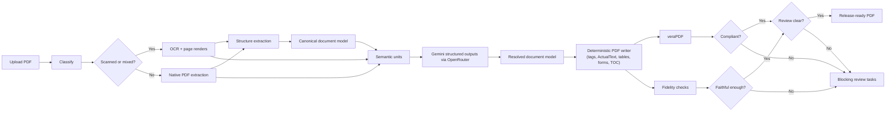

# PDF Accessibility App

CUNY AI Lab's PDF remediation app turns uploaded PDFs into accessible output PDFs with a strict release gate:

- PDF/UA-1 compliance via `veraPDF`
- fidelity checks for text, reading order, tables, forms, links, and figures
- human review only where semantics still need judgment

The current design is Gemini-first for hard semantic decisions, but deterministic for PDF mutation.

## What The App Does

The runtime pipeline is:

1. `classify` - decide whether the PDF is digital, mixed, or scanned
2. `ocr` - add searchable text when needed
3. `structure` - extract document structure and build a canonical document model
4. `semantic adjudication` - ground Gemini against page images, native extraction, OCR candidates, and local context
5. `tag` - write the accessible PDF deterministically with `pikepdf`
6. `validate` - run `veraPDF` against PDF/UA-1
7. `fidelity` - decide whether the output is faithful enough for release
8. `review` - create targeted review tasks only for unresolved semantics

## Architecture



More detail: [docs/architecture.md](docs/architecture.md)

## Current Evidence

### Exact curated corpus

Artifact: [backend/data/benchmarks/corpus_20260308_202258/corpus_report.md](backend/data/benchmarks/corpus_20260308_202258/corpus_report.md)

- `25 / 25` successful outputs complete, compliant, and fidelity-passed
- `2` remaining failures are damaged input PDFs

### Representative CUNY-like corpus

Artifact: [backend/data/benchmarks/corpus_20260309_134955/corpus_report.md](backend/data/benchmarks/corpus_20260309_134955/corpus_report.md)

Corpus mix:
- faculty/admin guides
- articles and readings
- syllabi/course materials
- scans

Results:
- `10 / 10` complete
- `10 / 10` compliant
- `10 / 10` fidelity-passed
- average OpenRouter cost per PDF: `$0.275192`
- median OpenRouter cost per PDF: `$0.134327`
- average cost per page: `$0.025163`

### Official form set (stress suite)

Artifact: [backend/data/benchmarks/corpus_20260309_123540/corpus_report.md](backend/data/benchmarks/corpus_20260309_123540/corpus_report.md)

- `7 / 7` complete
- `7 / 7` compliant
- `7 / 7` fidelity-passed

### Benchmarks and cost notes

See [docs/benchmarks.md](docs/benchmarks.md)

## Semantics Strategy

The app does not rely on one extractor.

- native PDF extraction anchors geometry and text where possible
- OCR provides local candidate text on hard regions
- Gemini decides meaning for hard units such as:
  - suspicious text blocks
  - complex tables
  - form labels
  - figures vs non-figures
  - TOC groups
  - complex reading-order pages
- deterministic code writes the final PDF objects

That split matters:
- Gemini decides semantics
- code decides PDF mutation
- `veraPDF` and fidelity decide release

## What Is Strong Today

- PDF/UA-1 tagging and metadata
- font remediation and Unicode repair
- link and annotation tagging
- TOC generation
- form labeling
- table risk detection and review targeting
- figure reclassification when a "figure" is really a table or form region
- OpenRouter structured outputs with prompt caching, retries, and cost tracking

## What Is Still Partial

- complex table semantics beyond header-row and row-header modeling
- visual accessibility audits such as color contrast and color-only meaning
- rich media and math semantics
- some PDF/UA rule families still remain `partial` or `unproven` in the coverage matrix even though the current corpora pass cleanly

See:
- [ACCESSIBILITY_COVERAGE.md](ACCESSIBILITY_COVERAGE.md)
- [docs/a11y_coverage_matrix.md](docs/a11y_coverage_matrix.md)
- [docs/pdfua_rule_coverage_matrix.md](docs/pdfua_rule_coverage_matrix.md)

## Repository Layout

```text
backend/
  app/
    api/                 FastAPI endpoints
    pipeline/            classify, ocr, structure, tag, validate, fidelity
    services/            semantic adjudication, previews, storage, LLM client
    models.py            SQLAlchemy models
    config.py            app settings
  scripts/               benchmark and docs utilities
  tests/                 backend test suite

frontend/
  src/
    pages/               dashboard, review, job detail
    components/          review/editor/report UI
    api/                 client calls and query hooks
    types/               shared TS types

data/
  uploads/, processing/, output/, benchmarks/
```

## Prerequisites

| Dependency | Purpose |
|---|---|
| Python 3.12+ | backend runtime |
| [uv](https://docs.astral.sh/uv/) | Python package manager |
| [Bun](https://bun.sh/) | frontend package manager/runtime |
| [OCRmyPDF](https://ocrmypdf.readthedocs.io/) | OCR for scanned pages |
| [Ghostscript](https://www.ghostscript.com/) | font embedding and PDF rewriting |
| [veraPDF](https://verapdf.org/) | PDF/UA validation |
| [Poppler](https://poppler.freedesktop.org/) | page preview rendering |
| `tesseract` | local crop OCR grounding |

Server/runtime packages commonly needed:
- Ubuntu/Debian: `ghostscript`, `poppler-utils`, `tesseract-ocr`, Java runtime for `veraPDF`
- macOS (local only): Homebrew packages are fine, but deployment should rely on explicit paths or standard `PATH`

## Setup

```bash
cp .env.example .env
cd backend && uv sync
cd ../frontend && bun install
```

Important environment variables:

```env
LLM_BASE_URL=https://openrouter.ai/api/v1
LLM_API_KEY=...
LLM_MODEL=google/gemini-3-flash-preview
LLM_MAX_CONCURRENCY=4
LLM_RETRY_MAX_BACKOFF_SECONDS=30
OCR_LANGUAGE=eng
VERAPDF_PATH=verapdf
GHOSTSCRIPT_PATH=gs
TESSERACT_PATH=tesseract
PDFTOPPM_PATH=pdftoppm
BINARY_SEARCH_DIRS=/usr/bin,/usr/local/bin
```

Binary resolution order:
1. explicit setting or env var (`*_PATH`)
2. normal `PATH`
3. `BINARY_SEARCH_DIRS`
4. local fallback directories used for development convenience

## Development

Start the app locally:

```bash
# backend
cd /Users/stephenzweibel/Apps/pdf-accessibility-app/backend
uv run uvicorn app.main:app --reload --port 8001

# frontend
cd /Users/stephenzweibel/Apps/pdf-accessibility-app/frontend
bun dev
```

Endpoints:
- frontend: <http://127.0.0.1:5173>
- backend: <http://127.0.0.1:8001>

## Tests

```bash
cd /Users/stephenzweibel/Apps/pdf-accessibility-app/backend
PYTHONPATH=. uv run pytest tests -q

cd /Users/stephenzweibel/Apps/pdf-accessibility-app/frontend
bun run build
```

## Benchmarks

Representative corpus:

```bash
cd /Users/stephenzweibel/Apps/pdf-accessibility-app/backend
PYTHONPATH=. uv run python scripts/corpus_benchmark.py --exclude-wac
```

Regenerate the PDF/UA matrix:

```bash
cd /Users/stephenzweibel/Apps/pdf-accessibility-app/backend
PYTHONPATH=. uv run python scripts/generate_pdfua_rule_coverage.py
```

## Documentation Map

- [docs/architecture.md](docs/architecture.md)
- [docs/benchmarks.md](docs/benchmarks.md)
- [ACCESSIBILITY_COVERAGE.md](ACCESSIBILITY_COVERAGE.md)
- [docs/a11y_coverage_matrix.md](docs/a11y_coverage_matrix.md)
- [docs/pdfua_rule_coverage_matrix.md](docs/pdfua_rule_coverage_matrix.md)
- [backend/README.md](backend/README.md)
- [frontend/README.md](frontend/README.md)
