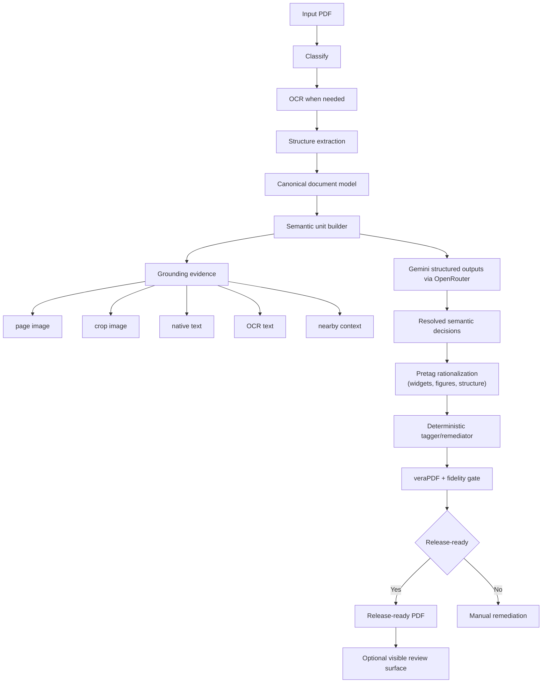

# Architecture

Updated: 2026-03-16

This app has two distinct layers:

1. semantic interpretation
2. deterministic PDF writing and release gating

That split is deliberate. Gemini is used where meaning is hard. The PDF writer stays deterministic.

The visible product model is also split cleanly:

1. release-ready output
2. manual remediation when trustworthiness is not high enough
3. optional advanced review only for human-legible visible output

## Runtime flow

## Session boundary

The product uses anonymous browser sessions instead of user accounts.

- FastAPI middleware assigns an HTTP-only cookie to each browser
- every job row is owned by a hash of that session token
- list, detail, download, preview, SSE progress, and review routes are all scoped to the current browser session
- jobs and their files are ephemeral and expire after `JOB_TTL_HOURS`, which defaults to `12`

This keeps the app login-free while preventing one browser session from seeing another session's PDFs through the product API.
It does not change the fact that semantic adjudication still uses the configured
external LLM provider.

## Semantic units

The semantic layer no longer treats text, tables, forms, figures, and TOC candidates as unrelated flows. It normalizes them into local regions with shared evidence:

- page number
- bounding box
- kind candidate
- native text candidate
- OCR text candidate
- image crop
- nearby structure context
- confidence and provenance

Current semantic-unit families:

- suspicious text blocks
- reading-order pages
- tables
- forms
- figures
- TOC groups

## Gemini's role

Gemini is the primary semantic judge for hard units.

It decides things like:
- what assistive tech should hear for a garbled block
- which table rows are headers
- what a form field should be labeled
- whether a figure candidate is actually a figure, a table, or a form region
- whether a page region is a TOC group

Gemini is not allowed to write PDF objects directly.

## Deterministic layer

The deterministic layer is responsible for:

- pretag rationalization of suspicious widgets and under-described visual figures
- PDF/UA tag tree construction
- `/ActualText`
- form `/TU`
- artifacts
- bookmarks and TOC structure
- font remediation
- metadata
- final validation and fidelity gating

Main implementation files:

- [backend/app/pipeline/orchestrator.py](../backend/app/pipeline/orchestrator.py)
- [backend/app/pipeline/tagger.py](../backend/app/pipeline/tagger.py)
- [backend/app/pipeline/validator.py](../backend/app/pipeline/validator.py)
- [backend/app/pipeline/fidelity.py](../backend/app/pipeline/fidelity.py)

## Key services

### Canonical model
- [backend/app/services/document_intelligence_models.py](../backend/app/services/document_intelligence_models.py)
- [backend/app/services/document_intelligence.py](../backend/app/services/document_intelligence.py)

### Generic semantic adjudication
- [backend/app/services/semantic_units.py](../backend/app/services/semantic_units.py)
- [backend/app/services/intelligence_gemini_semantics.py](../backend/app/services/intelligence_gemini_semantics.py)

### Specialized wrappers over the shared semantic engine
- [backend/app/services/intelligence_gemini_pages.py](../backend/app/services/intelligence_gemini_pages.py)
- [backend/app/services/intelligence_gemini_tables.py](../backend/app/services/intelligence_gemini_tables.py)
- [backend/app/services/intelligence_gemini_forms.py](../backend/app/services/intelligence_gemini_forms.py)
- [backend/app/services/intelligence_gemini_figures.py](../backend/app/services/intelligence_gemini_figures.py)
- [backend/app/services/intelligence_gemini_toc.py](../backend/app/services/intelligence_gemini_toc.py)

### Shared LLM transport
- [backend/app/services/llm_client.py](../backend/app/services/llm_client.py)
- [backend/app/services/intelligence_llm_utils.py](../backend/app/services/intelligence_llm_utils.py)

## Transport choices

Semantic calls use OpenRouter with Gemini structured outputs.

Important properties:
- `json_schema` structured output requests
- `provider.require_parameters=true`
- retry and `Retry-After` support
- concurrency limits
- prompt caching breakpoints
- real cost tracking from OpenRouter response usage fields

## Release gate

A document is release-ready only when all three are true:

1. `veraPDF` says compliant
2. fidelity says faithful enough
3. the run ends `complete`, not `manual_remediation`

Optional visible review items do not block release. Hidden structural blockers still do.

## Known limits

- complex tables still require stronger extraction or manual remediation in some cases
- visual WCAG issues such as contrast are not yet a first-class audit layer
- math support is conservative formula tagging plus speakable formula text, not rich equation semantics
- rich media remains partial
- semantic adjudication still depends on good local page/crop evidence
